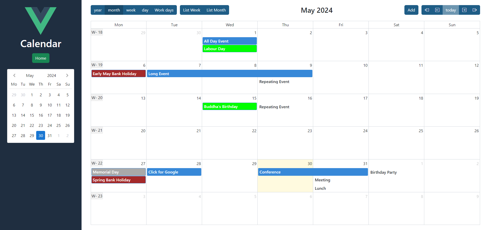

<h1 style='color: dodgerblue;'> vue3-fullcalendar </h1>

## What is this?
This app is an [example of how to use FullCalendar](https://github.com/YSHgroup/vue3-fullcalendar-bootstrap.git), which illustrates almost all functionalities of the library. It serves as a simulation of a calendar that can be used as a reference for building similar applications.

[Go to Website](https://yshgroup.github.io/vue3-fullcalendar-bootstrap/)




## Main Plugins and Links Used
 | Name | Description |
 |-|-|
 |[FullCalendar](https://fullcalendar.io/) | FullCalendar is a JavaScript library that seamlessly integrates with popular JavaScript frameworks such as Vue, React, and Angular. It provides a comprehensive set of features for creating interactive event calendars.|
 |[Bootstrap](https://getbootstrap.com/)|Bootstrap is an HTML, CSS, and JS library that focuses on simplifying the development of informative web pages.|
 |[date-fns](https://date-fns.org/)|date-fns is a comprehensive JavaScript library that provides a wide range of functions for working with dates and times. It offers a simple and efficient way to perform various date-related operations, including parsing, formatting, and manipulating dates.|
 |[Nager. Date](https://date.nager.at)|This is used as third party events server. Nager. Date is a popular project for querying holidays.|

## Features
- Showcase of FullCalendar library functionalities.
- Integration with Bootstrap for enhanced styling and responsive design.
- Utilization of date-fns library for handling date and time operations.

## Getting Started
To run this app locally, follow these steps:

1. Clone the repository: 
   ```
   git clone https://github.com/YSHgroup/vue3-fullcalendar-bootstrap.git
   ```

2. Install dependencies:
   ```
   npm install
   ```

3. Start the development server:
   ```
   npm run serve
   ```

4. Open the app in your browser:
   ```
   http://localhost:[port]
   ```

5. Deploy
   ```
   npm run deploy
   ```

## Usage
Once the app is running, you can interact with the calendar and explore its functionalities. The calendar displays events and allows you to perform actions such as adding, editing, and deleting events. You can navigate through different views, such as month, week, and day, to visualize events accordingly.

## Contributions
Contributions to this project are welcome. If you encounter any issues or have suggestions for improvements, please open an issue on the [GitHub repository](https://github.com/example/vue3-fullcalendar).

## License
This project is licensed under the [MIT License](https://opensource.org/licenses/MIT).